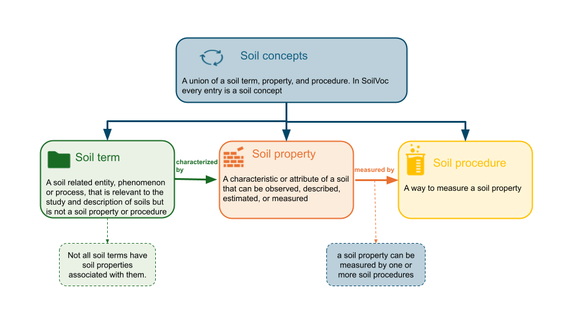

[](https://doi.org/10.5281/zenodo.19710233)

# EUSoilVoc

Harmonising terminology within or between communities is an important aspect in cooperation. The SKOS ontology is a common mechanism to advertise (and link between) terminologies.  

This repository aims to facilitate co-creation of a skos vocabulary around `soil observation data`. It includes definitions of soil properties (descriptors), indicators and observation methods. It also includes a number of tools to prepare and interact with the vocabulary:
- Tooling to [traverse to and from RDF](#traverse-tooling) (ttl) to CSV. CSV facilitates reviews by content specialists. While the RDF can be read by engines.
- A [REST API](#rest-api) to interact with the vocabulary (read only).
- A human friendly [web interface](#web-interface) to browse through the vocabulary. This website is available at [Soil-Vocabs Viewer](https://soilwise-he.github.io/soil-vocabs/), which is also linked to [w3id.org/EUSoilVoc](https://w3id.org/EUSoilVoc)
- A [traversing experiment](#soil-health-benchmarks) on the existing soil health benchmarks glossary 

## How to contribute
The current process for uploading new properties and procedures is through a [Github issue](https://github.com/soilwise-he/soil-vocabs/issues/new/choose). The workflow is displayed as below:




## Relevant terminologies

For the soil domain we should distinghuish various types of entities for which definitions can be listed.

- General glossary on soil related terms, what is soil, soil health, soil quality
- Soil **properties** / Soil health indicators to be monitored
- **Results**, in those cases that a result is a reference to a classification (low, medium, high) a proper definition of the class needs to be defined
- **Observation Procedures** describe how an observation has been performed
- The potential occurence of a soil **threat** can be determined by combining a number of indicators
- **Remediation procedures** describe how soil threats can be reduced
- Ability to perform Soil **functions** is estimated by the quality indicators
- Feature Of Interest **types**, an (set of) observation should be representative for a FOI, eg a horizon, profile, plot, site, body

## Traverse tooling

The main published vocabulary files are available in the repository root, while support tooling lives in dedicated folders:

- `scripts/restore_soilvoc_from_csv.py` rebuilds or compares `SoilVoc.ttl` from `SoilVoc_concepts.csv`
- `scripts/generate_soilvoc_html.py` refreshes `assets/soilvoc_data.json` from `SoilVoc.ttl`
- `assets/VERSION` stores the viewer version used in the generated JSON payload
- `docker/Dockerfile` builds the combined API + static viewer container

Typical local commands:

```bash
python scripts/restore_soilvoc_from_csv.py --csv SoilVoc_concepts.csv --out SoilVoc_restored.ttl --compare SoilVoc.ttl
python scripts/generate_soilvoc_html.py
docker build -f docker/Dockerfile -t soilvoc .
```

## Rest api

A REST API for searching concepts, getting concept details and getting procedures linked to properties. Available at [SoilVoc api]([#/concepts/search_api_v1_concepts_search_get](http://api.soilwise.wetransform.eu/vocab/docs)). Read more at [api/README.md](./api/README.md).

## Web interface

A browser-based viewer to explore concepts in hierarchies. Updates to the vocabulary are automatically reflected on the web interface using a github action.
Available at [soil-vocabs](https://w3id.org/eusoilvoc).

## Soil health Benchmarks

This repository includes an effort to convert the existing [Benchmarks glossary](https://soilhealthbenchmarks.eu/glossary/) to RDF.

Visit the [soil_health_benchmarks](./soil_health_benchmarks) folder for glossary-to-SKOS conversion and interlinking utilities.

## Installation instructions

The software in this repository is available as [docker image](https://github.com/soilwise-he/soil-vocabs/pkgs/container/soil-vocabs). See details of the component on how to run the utility. 

---

## Soilwise-he project
This work has been initiated as part of the [Soilwise-he](https://soilwise-he.eu) project. The project receives
funding from the European Union’s HORIZON Innovation Actions 2022 under grant agreement No.
101112838. Views and opinions expressed are however those of the author(s) only and do not necessarily
reflect those of the European Union or Research Executive Agency. Neither the European Union nor the
granting authority can be held responsible for them.
